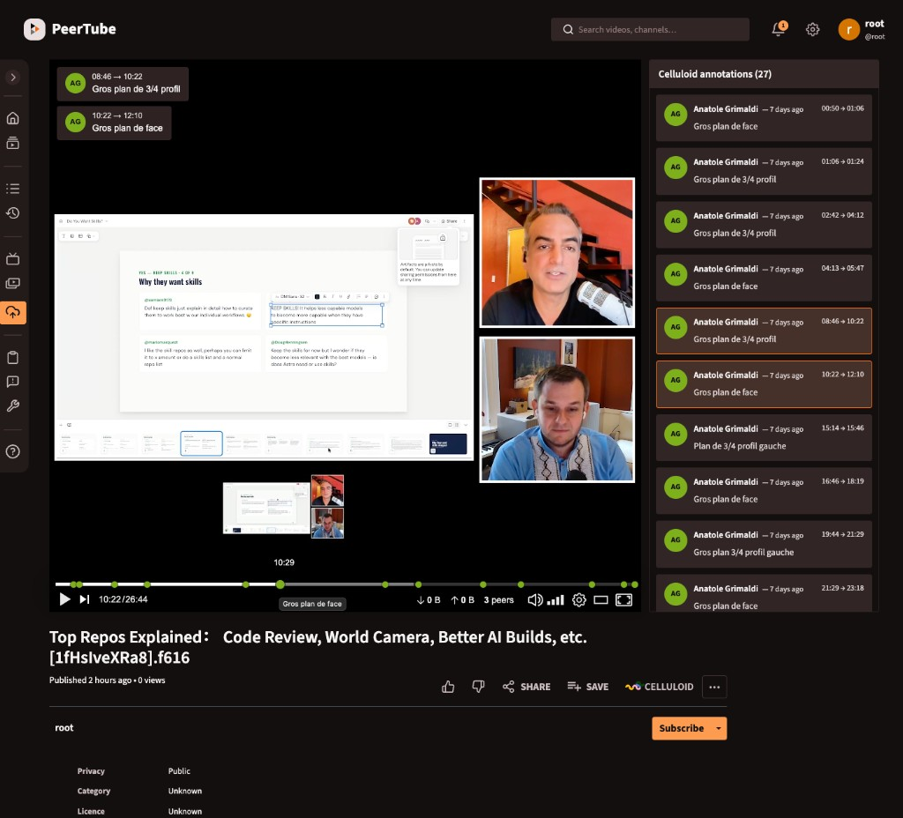

# peertube-plugin-celluloid

A [PeerTube](https://joinpeertube.org/) plugin that links a video to a
[Celluloid](https://celluloid.me) project and shows the project's annotations
on the player.



## Features

- Link a video to a Celluloid project (id or `https://celluloid.me/project/<id>`
URL), from the video form or from a button on the watch page (owner, moderators
and admins only).
- On the watch page, displays the project's annotations as a synced text overlay,
progress-bar markers, and a clickable list below the player.


## Configuration

In **Administration → Plugins → peertube-plugin-celluloid → Settings**, set the
**Celluloid instance URL** (default `https://celluloid.me`).

## Development

```bash
npm install      # also builds dist/
npm run build    # bundle server + client scripts
```


